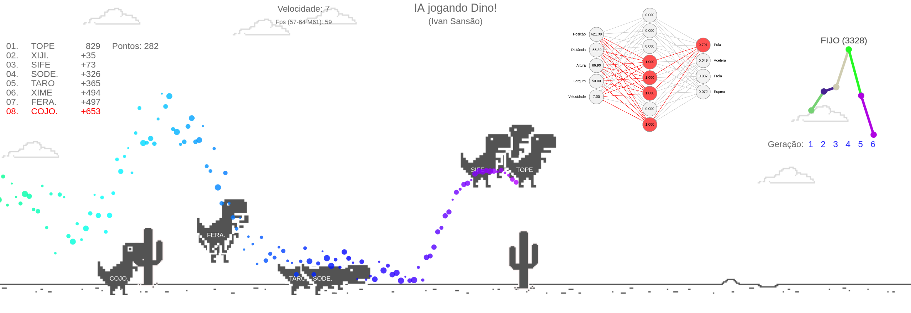

IA Jogando Google Dino em Javascript, veja abaixo prints com e sem os sensores.

<iframe width="560" height="315" src="https://www.youtube.com/embed/_Hvofo-71D4" title="YouTube video player" frameborder="0" allow="accelerometer; autoplay; clipboard-write; encrypted-media; gyroscope; picture-in-picture" allowfullscreen></iframe>

YOUTUBE (Clique nessa imagem para abrir o vídeo no YouTube)

PRINT

PRINT
